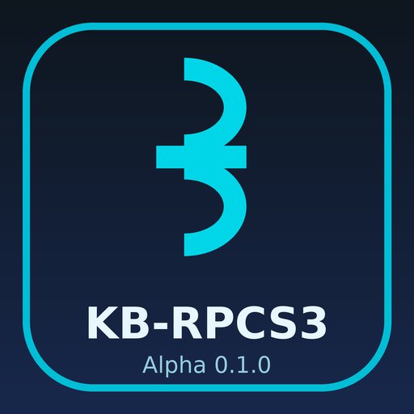

# KB-RPCS3

**An unofficial port of the RPCS3 PlayStation 3 emulator to jailbroken PS5 consoles.**

| | |
|---|---|
| Version | **Alpha 0.1.0** (2026-10-09) |
| Maintainer | KB |
| PS5 title ID | `PPSA99303` |
| This release | **source code only** — no PS5 binary yet ([why](LICENSING_STATUS.md)) |

KB-RPCS3 runs [RPCS3](https://rpcs3.net), the open-source PlayStation 3 emulator, as a native PS5
homebrew title with its own home screen, settings and game installer. It uses RPCS3's emulator core
through a Vulkan driver (RADV) running directly on the console.

> **Unofficial.** KB-RPCS3 is not made, endorsed or supported by the RPCS3 project or by Sony
> Interactive Entertainment. Please do not ask the RPCS3 team for help with it. "PlayStation", "PS3" and
> "PS5" are trade marks of Sony Interactive Entertainment Inc.

## Status of Alpha 0.1.0

**There is no downloadable PS5 package yet.** The PS5 title links RPCS3's GPL-2.0-only core with
GPL-3.0 PS5 components, and those licences cannot be combined in one distributed program. Permission
from the authors of the PS5 components is being sought; see [LICENSING_STATUS.md](LICENSING_STATUS.md).
Until then this release contains the source code and build instructions only.

What was tested on a real console (one PS5 Slim, firmware 13.60, etaHEN, kstuff lite, ShadowMountPlus)
with the development build this release is based on:

| Game | Result |
|---|---|
| LIMBO | playable: picture, sound and controls |
| WWE 12 | playable, with slowdowns during heavy moments |
| Grand Theft Auto IV | playable; roughly 13–27 FPS when driving at normal game speed (the game's own cap is 30) |

Other games have not been tested. See [COMPATIBILITY.md](COMPATIBILITY.md) and
[KNOWN_ISSUES.md](KNOWN_ISSUES.md).

**Not yet tested on a console:** the exact Alpha 0.1.0 source (it adds logging and off-by-default
experimental options on top of the tested build) and the KB-RPCS3 branding.

## Features

- Home screen with tabs for Games, Install, Settings and System.
- Global and per-game RPCS3 settings, with recommended settings for games in RPCS3's database.
- Optional PS5 home-screen tiles that start a game directly.
- PS3 firmware installation, PKG and RAP installation.
- DualSense controls, vibration, save data and trophy notifications.

## Documents

| | |
|---|---|
| [INSTALL.md](INSTALL.md) | What you need on the console, and how a build is installed |
| [BUILDING.md](BUILDING.md) | Building from source, applying the RPCS3 patch series |
| [COMPATIBILITY.md](COMPATIBILITY.md) | Tested games and requirements |
| [KNOWN_ISSUES.md](KNOWN_ISSUES.md) | Known problems and limitations |
| [RELEASE_NOTES-0.1.0.md](RELEASE_NOTES-0.1.0.md) | What this release contains |
| [LICENSING_STATUS.md](LICENSING_STATUS.md) | Licences, and why there is no binary yet |
| [THIRD_PARTY_NOTICES.md](THIRD_PARTY_NOTICES.md) | Credits and licences of everything KB-RPCS3 builds on |

## Credits

KB-RPCS3 exists because of **RPCS3** — the PlayStation 3 emulator by the RPCS3 team and its many
contributors (https://github.com/RPCS3/rpcs3). It is built on the PS5 homebrew work of **Mihawk**
(PS5_Vulkan, the PS5 Vulkan Template, the PS5 platform layer), **BlackBearReloaded** (ps5-homebrew-ui),
the **ps5-payload-dev** SDK authors, **Sascha Willems** (Vulkan examples) and the Mesa/RADV developers.
Full credits: [THIRD_PARTY_NOTICES.md](THIRD_PARTY_NOTICES.md).

## Licence

This repository contains separately licensed parts: the RPCS3 patch series is GPL-2.0-only, like RPCS3;
the PS5 title shell in `app/` is MIT and GPL-3.0-or-later per file. See
[LICENSING_STATUS.md](LICENSING_STATUS.md), `app/LICENSING.md` and `LICENSES/`.

No PS3 or PS5 firmware, games, keys or other Sony files are included. Use your own legally obtained
firmware and games.
