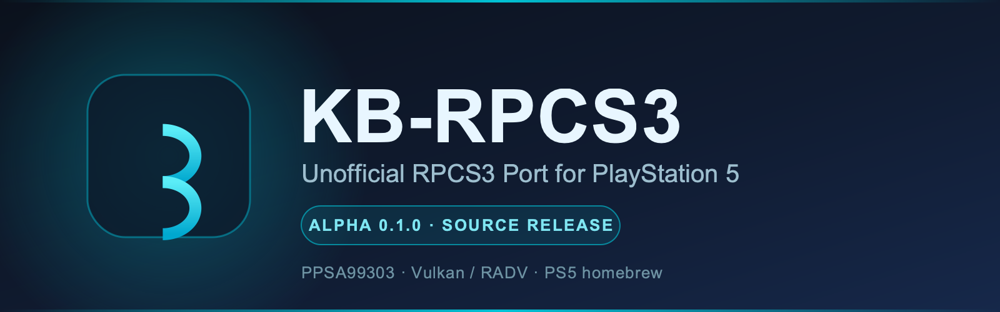
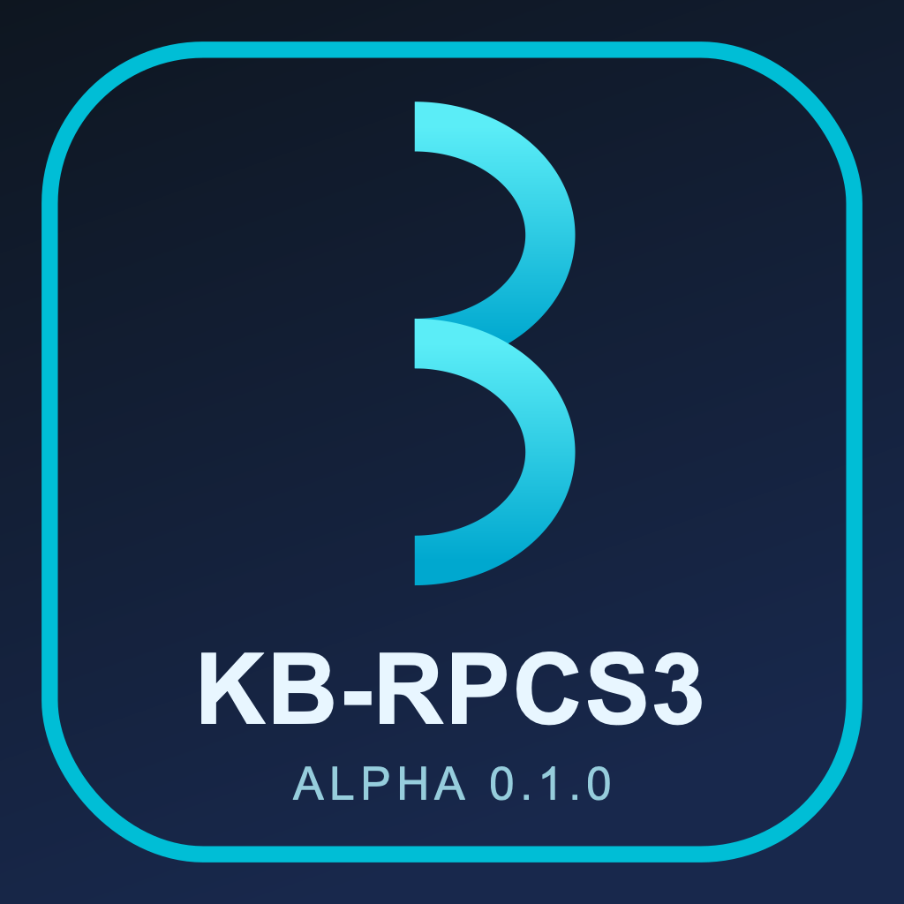

<div align="center">
  
</div>

<h1 align="center">KB-RPCS3</h1>

<p align="center"><b>Unofficial RPCS3 Port for PlayStation 5.</b></p>

<p align="center">
  
  
  
  
  
</p>

KB-RPCS3 runs [RPCS3](https://rpcs3.net), the open-source PlayStation 3 emulator, as a
**native PS5 homebrew title**. Its Mesa/RADV Vulkan renderer talks to the console
directly, RPCS3's emulator core does the PlayStation 3 work, and a PS5-native shell
provides the home screen, per-game settings and installers.

> **Alpha 0.1.0 is a source release.** There is **no downloadable PS5 package yet** —
> the title's licence mix is unresolved, so a binary cannot be distributed. The
> source, the RPCS3 patch series and the build instructions are public. See
> [Licensing status](#licensing).

> **Unofficial.** KB-RPCS3 is not made, endorsed or supported by the RPCS3 project or
> by Sony Interactive Entertainment. Please do not ask the RPCS3 team for help with
> it. "PlayStation", "PS3" and "PS5" are trade marks of Sony Interactive Entertainment
> Inc.

## Contents

[Downloads](#downloads) · [Status](#status-of-alpha-010) · [Features](#features) ·
[Compatibility](#game-compatibility) · [Screenshots](#screenshots) ·
[Requirements](#system-requirements) · [Installation](#installation) ·
[Performance](#performance-and-known-limitations) · [Building from source](#building-from-source) ·
[Credits](#credits) · [Licensing](#licensing) · [Contributing](#contributing) ·
[Disclaimer](#disclaimer)

## Downloads

| | |
|---|---|
| **Source code (recommended)** | [`KB-RPCS3-0.1.0-Source.tar.gz`](https://github.com/kamb205/KB-RPCS3/releases/tag/v0.1.0-alpha) — the repository at tag `v0.1.0-alpha`, including the RPCS3 patch series, the PS5 title shell, tools and documentation |
| **Repository** | [github.com/kamb205/KB-RPCS3](https://github.com/kamb205/KB-RPCS3) |
| **PS5 installable package** | **Not available.** Distribution is pending a licence resolution ([why](#licensing)); no binary is published, tested or promised |

The source archive ships SHA-256 checksums on the [release page](https://github.com/kamb205/KB-RPCS3/releases/tag/v0.1.0-alpha).

## Status of Alpha 0.1.0

KB-RPCS3 is an **early alpha**. This release publishes what exists — a working
development build's source and a tested port — and is explicit about what has not
been done yet.

- **No PS5 binary is distributed.** The title links RPCS3's **GPL-2.0-only** core with
  **GPL-3.0** PS5 components; those licences cannot be combined in one distributed
  program. The current combined executable has an **unresolved GPL compatibility
  issue** and has **not passed final PS5 testing**.
- **The exact Alpha 0.1.0 source has not finished console regression testing.** Games
  were verified with the development build this release is based on; Alpha 0.1.0 adds
  speed/timing logging and off-by-default experimental options on top of that build.
- **No performance improvement is claimed.** The experimental SPU options are off by
  default and have not been measured at normal game speed.

## Features

- **RPCS3 on the console** — the emulator core built for the PS5, rendering through
  Mesa/RADV Vulkan directly on the hardware.
- **Native home screen** (`PPSA99303`) with **Games**, **Install**, **Settings** and
  **System** tabs.
- **Global and per-game settings**, with recommended settings pulled from RPCS3's
  public configuration database when it is available.
- **Installers** for PS3 firmware (`PS3UPDAT.PUP`), PSN packages (`.pkg`) and licences
  (`.rap`).
- **PS5 home-screen tiles** that launch a game directly.
- **DualSense** controls, vibration, save data and trophy notifications.
- **Benchmark tooling** that records the effective game speed, so results can be shown
  to have been taken at normal speed.

## Game compatibility

Verified on **one PS5 Slim (firmware 13.60, etaHEN, kstuff lite, ShadowMountPlus)** with
the development build Alpha 0.1.0 is based on, at **normal game speed** (Clocks
scale 100, Frame limit Auto):

| Game | Serial | Result |
|---|---|---|
| **LIMBO** | `HPEB00564` | Playable — picture, sound and controls. |
| **WWE '12** | `BLES01439` | Playable — menus run near 60 FPS; matches slow down during big moves (CPU-limited). |
| **Grand Theft Auto IV** | `BLES01128` | Boots and plays, with **substantial performance limitations** — cutscenes at the game's own 30 FPS cap; roughly 13–27 FPS when driving, with occasional audio stutter. Needs "SPU XFloat Accuracy: Accurate" or cars fall through the road. |

Every other PS3 game is **untested** on KB-RPCS3. RPCS3's own
[compatibility list](https://rpcs3.net/compatibility) is a hint, but the PS5's CPU is
much slower than the PCs that list is based on. See
[COMPATIBILITY.md](COMPATIBILITY.md) for the full qualification of these results, and
[KNOWN_ISSUES.md](KNOWN_ISSUES.md) for limitations.

> **On older FPS numbers.** During development some GTA IV benchmarks ran with
> **Clocks scale 300** and Frame limit Off so the game's 30 FPS cap would not hide CPU
> cost; in that mode the game runs about three times too fast, so those numbers
> (around 20–22 FPS) are **not** normal-play results and are not quoted as such.

## Screenshots

KB-RPCS3 does not publish fabricated screenshots. Genuine hardware captures will be
added here once the Alpha 0.1.0 candidate has finished console regression testing and
screenshots have been taken on a real console (L3 + R3 on the home screen saves one to
`rpcs3/screenshots/` on the title).

Until then, the safest visual reference is the title icon, shown here and shipped in
the source at [`app/ps5/sce_sys/icon0.png`](app/ps5/sce_sys/icon0.png):

<p align="center">
  
</p>

<p align="center"><sub>Original KB-RPCS3 icon (alpha 0.1.0). Not a screenshot of gameplay.</sub></p>

## System requirements

**To run a build (on the console):**

| Requirement | Notes |
|---|---|
| Jailbroken PS5 | Developed and tested on a PS5 Slim, firmware 13.60 |
| Homebrew enabler | etaHEN (FTP on port 1337, ELF loader on port 9021) |
| Kernel extension | kstuff lite — load **once** per console boot |
| Folder-title loader | [ShadowMountPlus](https://github.com/drakmor/ShadowMountPlus) for titles under `/data/homebrew/` |
| Your own PS3 firmware | `PS3UPDAT.PUP` from Sony's PS3 update page |
| Your own games | PS3 discs as `.iso`/folders; PSN titles as `.pkg` + `.rap` |

KB-RPCS3 includes none of the above. Other firmware versions and loaders may work but
are untested.

**To build from source:** a Linux/arm64 host with the PS5 toolchain — see
[Building from source](#building-from-source).

## Installation

**Alpha 0.1.0 has no downloadable build.** Installation today means building it
yourself from source, for your own use, then deploying the title folder. The full
procedure is in [INSTALL.md](INSTALL.md); in short:

1. Build the title (see [Building from source](#building-from-source)).
2. Copy the built `dist/PPSA99303/` folder to `/data/homebrew/PPSA99303/` on the
   console (for example over etaHEN's FTP server).
3. Let ShadowMountPlus register it — **KB-RPCS3** appears on the home screen.
4. Put `PS3UPDAT.PUP` in `rpcs3/` inside the title folder and use **Install → PS3
   firmware**.
5. Add games to `rpcs3/games/` (disc images) or `packages/` + `exdata/` (PSN), then
   **Install → Packages**.

Do not redistribute a build you make: a combined binary cannot be distributed today
([why](#licensing)).

## Performance and known limitations

- **CPU-bound, not GPU-bound.** Demanding games are limited by how fast the PS5 runs
  emulated SPU code. GTA IV runs at roughly **13–27 FPS while driving**.
- **First-visit stutter.** Entering a new area compiles SPU code and shaders; both are
  cached, so later visits are smoother.
- **Normal speed needs Clocks scale 100 and Frame limit Auto.** Per-game configs live
  in `rpcs3/custom_configs/`; other values change how fast games run.
- **Native TLS does not work on the PS5 yet** — KB-RPCS3 uses emulated TLS. Do not
  build with `-fno-emulated-tls`.
- **It is an alpha:** expect crashes. Keep a known-good build to fall back to
  ([ROLLBACK.md](ROLLBACK.md)).

The complete list is in [KNOWN_ISSUES.md](KNOWN_ISSUES.md).

## Building from source

KB-RPCS3 has two separately licensed parts, combined only at build time on your own
machine:

| Part | Folder | Licence |
|---|---|---|
| **RPCS3 + the KB-RPCS3 core patches** | `port/rpcs3-patches/`, applied to upstream RPCS3 | GPL-2.0-only (RPCS3's licence) |
| **The PS5 title shell** (home screen, settings, installers, platform glue) | `app/` | mixed — MIT base, GPL-3.0-or-later UI and title code (`app/LICENSING.md`) |

```bash
# 1. Fetch and patch upstream RPCS3 (revision 46aee28f8, 47 patches)
port/apply-rpcs3-patches.sh /path/to/rpcs3

# 2. Build the emulator core (about two hours on 8 cores)
SRC_DIR=/path/to/rpcs3 BUILD_DIR=/path/to/rpcs3-build JOBS=8 port/rpcs3-build.sh rpcs3_ps5

# 3. Build the PS5 title
APP_DIR=/path/to/app-build-copy RPCS3_BUILD_DIR=/path/to/rpcs3-build tools/vm-build-app.sh
```

The build scripts currently expect the PS5 toolchain and dependencies at fixed paths
inside a build VM; [BUILDING.md](BUILDING.md) documents the exact layout, the
dependencies and their licences, and the off-by-default experimental options. Read
[Licensing status](LICENSING_STATUS.md) before distributing anything you build.

## Credits

KB-RPCS3 stands entirely on other people's work:

- **[RPCS3](https://github.com/RPCS3/rpcs3)** — the PlayStation 3 emulator, by the
  RPCS3 team and its many contributors. KB-RPCS3 is a port of it and does not exist
  without it.
- **Mihawk** — PS5_Vulkan (RADV/Mesa for PS5, the link recipe and `libc.prx`), the PS5
  Vulkan Template and the PS5 platform layer.
- **BlackBearReloaded** — the `ps5-homebrew-ui` kit the home screen is drawn with.
- **ps5-payload-dev** — the PS5 payload SDK.
- **Sascha Willems** — the Vulkan example base the template builds on.
- **The Mesa/RADV developers** — the Vulkan driver.

Full authorship and licence details are in
[THIRD_PARTY_NOTICES.md](THIRD_PARTY_NOTICES.md).

## Licensing

KB-RPCS3 is made of **separately licensed parts**:

- The RPCS3 patch series (`port/rpcs3-patches/`) is **GPL-2.0-only**, like RPCS3.
- The PS5 title shell in `app/` is **MIT** and **GPL-3.0-or-later** per file.
- KB's own scripts are GPL-3.0-or-later unless a file says otherwise.

Because GPL-2.0-only and GPL-3.0 code cannot be combined in a distributed program,
**this release ships source only and no binary**. The reasoning, the component
inventory and the route to a lawful binary are in
[LICENSING_STATUS.md](LICENSING_STATUS.md); the licence texts are in
[`LICENSES/`](LICENSES/) and [`COPYING`](COPYING); per-file details are in
[`app/LICENSING.md`](app/LICENSING.md) and
[`THIRD_PARTY_NOTICES.md`](THIRD_PARTY_NOTICES.md).

No PS3 or PS5 firmware, games, keys, system files or other Sony content is included.
Use your own legally obtained firmware and games.

## Contributing

Contributions are welcome once there is something concrete to work on. Read
[CONTRIBUTING.md](CONTRIBUTING.md) first, then use the issue templates for
[bug reports](.github/ISSUE_TEMPLATE/bug_report.yml) and
[feature requests](.github/ISSUE_TEMPLATE/feature_request.yml), or open a pull request
with the [template](.github/PULL_REQUEST_TEMPLATE.md). Please report vulnerabilities
privately as described in [SECURITY.md](SECURITY.md), and follow the
[Code of Conduct](CODE_OF_CONDUCT.md). Planned work is in [ROADMAP.md](ROADMAP.md).

## Disclaimer

KB-RPCS3 is an **unofficial, non-commercial** project. It is **not** affiliated with,
authorised by, endorsed by or sponsored by Sony Interactive Entertainment Inc. or the
RPCS3 project. "PlayStation", "PlayStation 3", "PS3" and "PS5" are trade marks of Sony
Interactive Entertainment Inc.; "RPCS3" is the name of the RPCS3 project. No Sony
logo, firmware, key or system file is included, and no endorsement by any party is
implied. KB-RPCS3 does not provide, condone or support piracy — use your own legally
obtained games and firmware.
